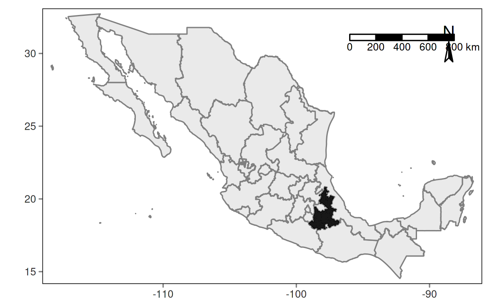
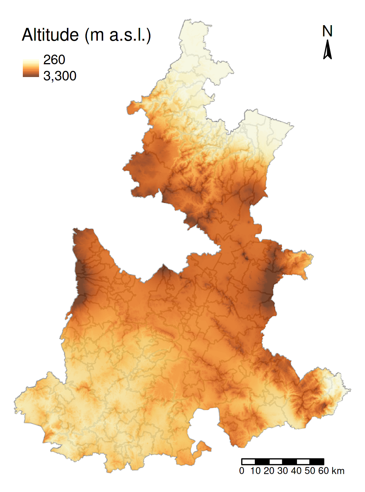
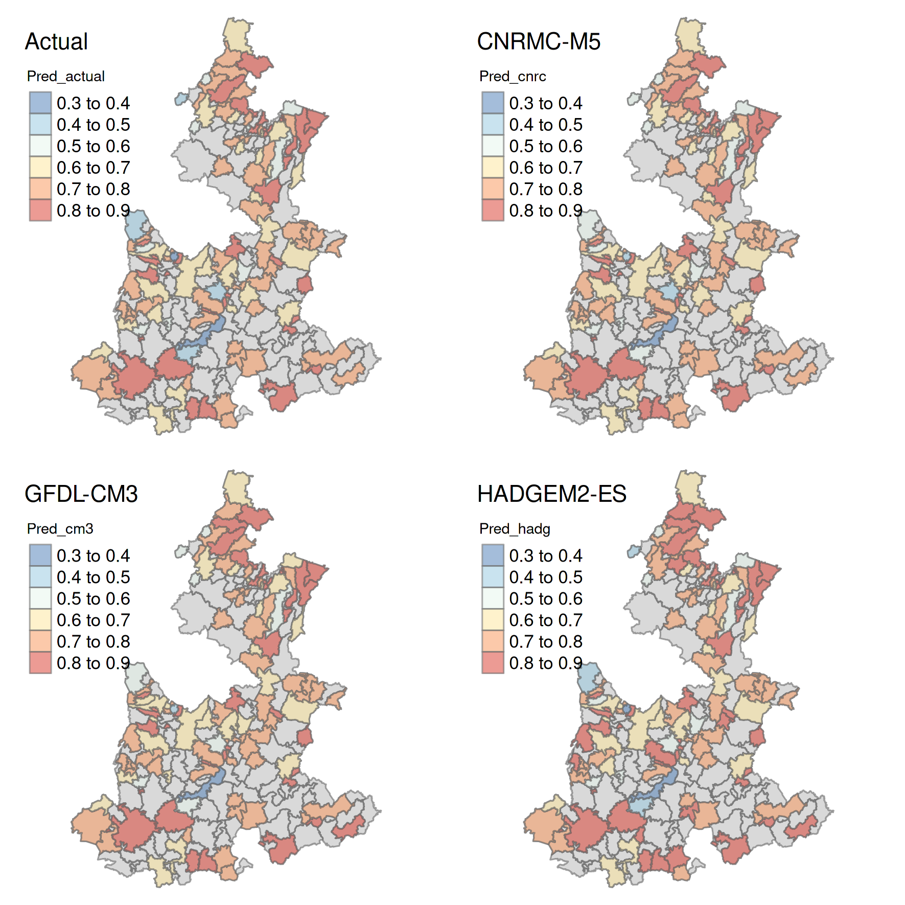
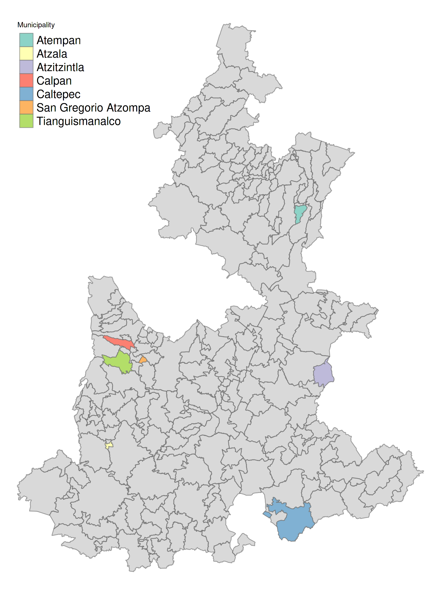

image-background: url(src="https://dlpoder.com/wp-content/uploads/2019/04/WhatsApp-Image-2019-04-18-at-00.37.24.jpeg")
image-position: 5%
class: middle, center

```{r, echo=FALSE, include=F}
library(here)
library(xaringanExtra)
library(png)
library(tidyverse)
library(sf)
library(here)
library(rgeoda)
library(tmap)
library(patchwork)
library(spatialreg)
library(kableExtra)
library(pixiedust)

xaringanExtra::use_fit_screen()
xaringanExtra::use_tile_view()

knitr::opts_chunk$set(echo = FALSE, warning = FALSE)

```

# Landslide risk in multiple climate change scenarios

### Gonzalo Martínez Herrera


---
layout: true
background-image: url("concrete-crack-repair.jpg") 
background-position: -25%

---
## Introduction

.pull-left[

* Factors associated: 
  + Precipitation
  + Soil conditions
  + Slope
  + Land-use

* Interaction with climate change effects <sup>[1,2]</sup>

* Natural hazards? Socio-natural construction of risk<sup>[3]</sup>
]

.pull-right[


]

---
## Hypotesis

<br>

<br>

### 1. Landslide vulnerability is associated with productive activities.
    
<br>
    
###2. Climate change enhances vulnerability to landslides

???

1. Under the assumptions that productive activities modify the landscape in ways
that may increase the chance of a landslide the first...

2. As mentioned earlier, climate change influences precipitation temporal distribution
and intensity. Therefore, 

---
layout:false
class: inverse, middle, center

# Methods

```{r vulnerability, echo=FALSE, include=FALSE}
## 2007 national agricultural census ---------------------------

d_act <- readxl::read_xlsx(path = here('Proyecto', 'Datos', 'Censo_agr','dat_cag.xlsx'), sheet = 1)
d_der <- readxl::read_xlsx(path = here('Proyecto', 'Datos', 'Censo_agr','dat_cag.xlsx'), sheet = 4)  
d_act_comp <- readxl::read_xlsx(path = here('Proyecto', 'Datos', 'Censo_agr','dat_cag.xlsx'), sheet = 8)
d_riego <- readxl::read_xlsx(path = here('Proyecto', 'Datos', 'Censo_agr','dat_cag.xlsx'), sheet = 10)
  
nam_act <-  colnames(d_act)

d_act %>% 
  select(-4,-6) %>% 
  rename('nom_mun' = 1,
         'uni_prod' = 2,
         'sup_tot'= 3,
         'agr_liv'= 4,
         'n_agr_liv'= 5) %>% 
  mutate(agr_liv = (agr_liv * 100)/ sup_tot,
         n_agr_liv = (n_agr_liv * 100)/ sup_tot) -> d_act

# Land rights

d_der %>% 
  rename('nom_mun' = 1,
         'sup_tot'= 2) %>% 
  mutate(p_own = (t_propia * 100)/ sup_tot,
         p_rent = (t_rent * 100)/ sup_tot,
         p_plot = (t_parcela * 100)/ sup_tot,
         p_lend = (t_prest * 100)/ sup_tot,
         p_other = (t_otros * 100)/ sup_tot) -> d_der


# Principal productive activity that is not agriculture nor cattle raising.

d_act_comp %>%
  select(-9) %>% 
  filter(uni_prod != "C")  %>% 
  mutate(across(.cols = 2:8, .fns = as.numeric)) %>% 
  mutate(ext_const = (ext_const * 100)/ uni_prod, # mining construction
         ext_min  = (ext_min * 100)/ uni_prod, # mining
         tourism  = (turismo * 100)/ uni_prod,
         industry = (industria * 100)/ uni_prod,
         commerce  = (comercio * 100)/ uni_prod,
         craftwork = (artesania * 100)/ uni_prod) -> d_act_comp

  
# Tipo de riego
 
  # Here I can select only one variable since they are mirrored.
  
  d_riego %>%
    select(-starts_with(match = regex(pattern = "uni"))) %>% 
    mutate(r_irr = (sup_rie * 100)/ sup_tot,
           r_rain = (sup_tem * 100)/ sup_tot) -> d_riego
  
  
## Vulnerability scores ----------------------------------------------

d_vul_com <- readxl::read_xlsx(path = here('Proyecto', 'Datos',
                                           'Indice_vul','vul_deslave.xlsx')) 

# For this file I extracted the municipality ID and the vulnerability scores. 
# Then I filtered (only keep the rows) that correspond to Puebla state.

d_vul_com %>% 
  select(2, 3, 4,8:14) %>% 
  rename(nom_est = 1,
         cve_mun = 2,
         nom_mun = 3,
         vul_actual = 4, vul_cnrmc = 5, vul_cm3 = 6, 
         vul_hadg = 7, vul_mpi = 8, vul_max = 9, vul_min = 10) %>% 
  mutate(cve_mun = as.character(cve_mun)) %>% 
  filter(`nom_est` == 'Puebla' & vul_actual != -9999 & 
           vul_cnrmc != -9999 & vul_cm3!= -9999 & 
           vul_hadg != -9999 & vul_mpi != -9999 & 
           vul_max != -9999 & vul_min != -9999) -> d_vulsco


shp_mun <- st_read(dsn = here('Proyecto', 'Datos', 'shapefiles', 'MUNICIPIOS.shp'))

shp_pue <- filter(shp_mun, CVE_ENT == 21) # Puebla ID is 21


## Join tibbles with vulnerability scores

# The inner join allows to keep only the rows from the first data frame. In this
# case I decided to keep only the municipalities that have information of climate
# change risk.

  d_vul <- inner_join(x = d_vulsco, y = d_act, by = 'nom_mun') 
  d_vul <- inner_join(x = d_vul, y = d_act_comp, by = 'nom_mun') 
  d_vul <- inner_join(x = d_vul, y= d_der, by = 'nom_mun')
  d_vul <- inner_join(x = d_vul, y= d_riego, by = 'nom_mun') 

# Removes total production units and total surface.  
  
d_vul %>% 
  select(!starts_with(regex(pattern = "sup"))) %>% 
  select(!starts_with(regex(pattern = "uni"))) -> d_vul

## Union with shapefile

shp_vmun <- right_join(x = shp_pue, y = d_vul, 
                       by = c('CVEGEO' = 'cve_mun')) 

## States shapefile

shp_est <- st_read(dsn = here('Proyecto','Datos', 'shapefiles', 'ESTADOS.shp'))

# Elevation raster

elev <- raster::raster(x = here('Proyecto', 'Datos', 'DEM', 'Puebla_r15m.bil')) 
  
```

---
layout: true
background-image: url("concrete-crack-repair.jpg") 
background-position: -25%

```{r mapmex, eval=FALSE}

m_mex <- tm_shape(shp_est) + 
  tm_borders(col = 'gray50') +
  tm_fill(col = 'gray90', alpha = 0.8) +
  tm_shape(shp_pue) +
  tm_fill(col = 'black', alpha = 0.9) +
  tm_grid(lines = F, labels.size = 0.5, n.x = 3, n.y = 3) +
  tm_layout(earth.boundary = T, earth.boundary.color = 'black') +
  tm_compass(size = 1, position = c('right', 'top')) +
  tm_scale_bar(width = 0.2, position = c('RIGHT', 'top'))


m_pue <- tm_shape(shp = shp_pue) +
  tm_polygons(col = 'gray70', alpha = 0.5, 
              border.col = 'gray40', border.alpha = 0.6) +
  tm_shape(elev) +
  tm_raster(alpha = 0.8, style = 'cont',   
            title = 'Altitude (m a.s.l.)', 
            breaks = c(260, 3300)) +
  tm_compass(size = 1, position = c('right', 'top')) +
  tm_scale_bar(width = 0.2, position = c('right', 'BOTTOM')) + 
  tm_layout(frame = F)

# tmap_save(tm = m_mex, filename = here('Proyecto', 'Presentacion', 'm_mex.png'), 
#           width = 10, units = 'cm', dpi = 300)
# 
# tmap_save(tm = m_pue, filename = here('Proyecto', 'Presentacion', 'm_puex.png'),
#           width = 8, units = 'cm', dpi = 300)

```

---

### Study site

.pull-left[

* Culturally and agroecologically diverse <sup>[4]</sup>.

* Cities and rural landscapes.

* Altitudinal variation.


]

.pull-right[






]


---
### Data collection

<br>

**INECC** - National Institute of Ecology and Climate Change
  
  + indexes of vulnerability to landslide risk (2019) <sup>[5]</sup>


<br>

**INEGI** - National Institute of Statistics and Geography

  + Agricultural census (2007) <sup>[6]</sup> : 
      - Municipality scale  
    
  + Spatial data <sup>[7]</sup>:     
      - Shapefiles of municipalities and states


After data manipulation n = 121 municipalities.
---

### Vulnerability indexes


.pull-left[


.RUred[Dimensions]:

* Exposition 

* Sensibility

* Adaptive capacity

.RUred[Models (RCP 8.5; 2015 - 2039)]: 

- Actual conditions (1950 - 2000)
    
- CNRMC-M5 
    
- GFDL-CM3
    
- HADGEM2-ES

]


```{r vulnerabilityboxplot, out.width="350px"}

d_vul %>% 
  select(4:7) %>% 
  gather('vul_actual', 'vul_cnrmc', 'vul_cm3', 'vul_hadg', 
         key = 'Vulnerability', value = 'score') %>% 
  ggplot(aes(y = score)) +
  geom_boxplot(aes(fill = Vulnerability), notch = T) +
  facet_grid(. ~ Vulnerability) +
  ylab('Index score') +
  theme_minimal() 
  

```

???

Models: less rain in general

* Exposition: 
  - Precipitation and P(landslides) 

* Sensibility:
  - Susceptible population
  - Vegetation status

* Adaptive capacity:
  - civil protection
  - tools to respond to landslides
  
---

### Vulnerability indexes

.pull-left[

Actual Model

```{r vactual, out.width="60%"}

qqnorm(d_vul$vul_actual)
qqline(d_vul$vul_actual)

```

CNRMC-M5

```{r cnrmc, out.width="60%"}

qqnorm(d_vul$vul_cnrmc)
qqline(d_vul$vul_cnrmc)
```

]

.pull-right[

GFDL-CM3

```{r cm3, out.width="60%"}

qqnorm(d_vul$vul_cm3)
qqline(d_vul$vul_cm3)

```

HADGEM2-ES

```{r hadg, out.width="60%"}

qqnorm(d_vul$vul_hadg)
qqline(d_vul$vul_hadg)
```
]

---

### Covariates exploration

.center[

```{r boxplots}

p_agr <- d_act %>% 
  ggplot(aes(y = agr_liv)) +
  geom_boxplot() +
  ylab('Agriculture/forestry (%)') +
  theme_minimal()


p_comp <- gather(data = d_act_comp,'industry', 'commerce', key = 'activity', value = 'percent') %>% 
  ggplot(aes(y = percent)) +
  geom_boxplot() +
  facet_grid(. ~ activity) +
  ylab('Productive units (%)') +
  theme_minimal()

# p_der <- gather(data = d_der, 'p_own', 'p_rent', 'p_plot', 'p_lend', 'p_other',
#        key = 'tenencia', value = 'percent') %>% 

p_der <-  ggplot(data = d_der, aes(y = p_own)) +
  geom_boxplot() +
  # facet_grid(. ~ tenencia) +
  ylab('Private plots (%)') +
  theme_minimal()

p_reg <- d_riego %>% 
  ggplot(aes(y = r_rain)) +
  geom_boxplot() +
  ylab('Rainfed plots (%)') +
  theme_minimal()

(p_agr | p_reg)/p_comp/p_der

```
]

???

* Hectares of agriculture, livestock, or forestry activity.

* Hectares of rainfed plots.

* Commercial and industial  units.

* Hectares of private lands within the municipality.


**All where standardized by calculating the percentage**

---

```{r, echo=FALSE,include=FALSE}
shp_vmun_sp <- as(object = shp_vmun, Class =  "Spatial", strict = F)

w_vul2 <- spdep::poly2nb(pl = shp_vmun_sp, queen = T)   #<<

w_vul2_lw <- spdep::nb2listw(neighbours = w_vul2, zero.policy = TRUE)     #<<
```


### Spatial autocorrelation

```{r spatialweights, echo=TRUE}

w_vul2 <- spdep::poly2nb(pl = shp_vmun_sp, queen = T)   #<<

w_vul2_lw <- spdep::nb2listw(neighbours = w_vul2, zero.policy = TRUE)     #<<

```

.pull-left[

Actual model

```{r mploact, out.width="50%"}
# Moran's I plot

mplot_vact <- spdep::moran.plot(x = shp_vmun_sp$vul_actual, listw = w_vul2_lw,
                                zero.policy = T, 
                                xlab = 'Standardized Actual index values',
                                ylab = 'Standardized Lagged Actual index values')

```

CNRMC-M5 model

```{r mplotcnr, out.width="50%"}
mplot_cnr <- spdep::moran.plot(x = shp_vmun_sp$vul_cnrmc, listw = w_vul2_lw,
                               zero.policy = T, 
                               xlab = 'Standardized CNRMC index values',
                               ylab = 'Standardized Lagged CNRMC index values')
```
]

.pull-right[

GFDL-CM3 model

```{r mplotcm3, out.width="50%"}
mplot_cm3 <- spdep::moran.plot(x = shp_vmun_sp$vul_cm3, listw = w_vul2_lw,
                               zero.policy = T, 
                               xlab = 'Standardized CM3 index values',
                               ylab = 'Standardized Lagged CM3 index values')
                                
```

HADGEM2-ES model

```{r mplothadg, out.width="50%"}
mplot_had <- spdep::moran.plot(x = shp_vmun_sp$vul_hadg, listw = w_vul2_lw,
                               zero.policy = T, 
                               xlab = 'Standardized HADG index values',
                               ylab = 'Standardized Lagged HADG index values')
```
]

---

### Spatial autocorrelation

 Moran's I statistic through Monte-Carlo permutations.

<br>

<br>

```{r morantest}
mor_v_act <- spdep::moran.mc(shp_vmun_sp$vul_actual, listw = w_vul2_lw, 
                nsim = 999,zero.policy = T) 

mor_v_cnr <- spdep::moran.mc(shp_vmun_sp$vul_cnrmc, listw = w_vul2_lw, 
                            nsim = 999,zero.policy = T) 

mor_v_c3 <- spdep::moran.mc(shp_vmun_sp$vul_cm3, listw = w_vul2_lw, 
                            nsim = 999,zero.policy = T) 

mor_v_hadg <- spdep::moran.mc(shp_vmun_sp$vul_hadg, listw = w_vul2_lw, 
                            nsim = 999,zero.policy = T) 

mor_list <- list(mor_v_act, mor_v_cnr, mor_v_c3, mor_v_hadg)

mor_tidy <- purrr::map_dfr(.x = mor_list, .f = broom::tidy)


mor_tidy %>% 
  add_column(model = c('Actual', 'CNRMC-M5', 'GFDL-CM3', 'HADGEM2-ES'),
             .before = 1) %>% 
  select(-method, -alternative) %>% 
kableExtra::kbl(format = 'html',
                col.names = c("Scenarios",
                              "Statistic",
                              "P-value",
                              "Iterations")) %>%
  kable_minimal()

```

---

### Spatial reggressions

General model:

```{r modelsample, echo=TRUE}

slm_vact <- lagsarlm(vul_actual ~ agr_liv + industry + commerce + p_own + r_rain, #<<
                     data = d_vul,  
                     listw = w_vul2_lw,  #<<
                     zero.policy = TRUE) 

slm_vac1 <- update(object = slm_vact, ~ . -agr_liv) # Simplification
```

Where: 

*vulnerability* = Vulnerability index scores

*agriliv* = (%) Hectares of agricultural, cattle raising, or forestry.

*industry* =(%)  Productive units with main industrial activity

*commerce* =  (%) Productive units with main commercial activity

*p_own* = (%) Hectares of privately own plots

*r_rain* = (%) Hectares of land that are under a rainfed watering regime.


???

**Standardization by calculating the percentage of hectares or productive units** 

---
layout:false
class: center, middle, inverse

# Results and discussion

---
layout: true
background-image: url("concrete-crack-repair.jpg") 
background-position: -25%

```{r OLSmodels, echo=FALSE, warning=FALSE}

m_vact <- lm(data = d_vul, vul_actual ~ agr_liv + industry + commerce + p_own + r_rain)
m_vcrn <- lm(data = d_vul, vul_cnrmc ~ agr_liv + industry + commerce + p_own + r_rain)
m_vcm3 <- lm(data = d_vul, vul_cm3 ~ agr_liv + industry + commerce + p_own + r_rain)
m_vhadg <- lm(data = d_vul, vul_hadg ~ agr_liv + industry + commerce + p_own + r_rain)

```

```{r lagspatialmodels, warning=FALSE, echo=FALSE, include=FALSE}

# Spatial lag models

slm_vact <- lagsarlm(vul_actual ~ agr_liv + industry + commerce + p_own + r_rain,
                     data = d_vul,
                     listw = w_vul2_lw, 
                     zero.policy = TRUE)

slm_vac1 <- update(object = slm_vact, ~ . -agr_liv)
slm_vac2 <- update(object = slm_vac1, ~ . -commerce)

aic_table_vact <- wiqid::AICtable(AIC(slm_vact, slm_vac1, slm_vac2)) 

# Model CRNMC

slm_vcrn <- lagsarlm(vul_cnrmc ~ agr_liv + industry + commerce + p_own + r_rain,
                     data = d_vul, listw = w_vul2_lw, zero.policy = TRUE)
                     
slm_vcrn1 <- update(slm_vcrn, ~ . -commerce)
slm_vcrn2 <- update(object = slm_vcrn1, ~ . -agr_liv)

aic_table_vcrn <- wiqid::AICtable(AIC(slm_vcrn, slm_vcrn1, slm_vcrn2)) 

# Model CM3

slm_vcm3 <- lagsarlm(vul_cm3 ~ agr_liv + industry + commerce + p_own + r_rain,
                     data = d_vul, listw = w_vul2_lw, zero.policy = TRUE)

slm_vcm31 <- update(slm_vcm3, ~ . -commerce)
slm_vcm32 <- update(object = slm_vcm31, ~ . -agr_liv)

aic_table_vcm3 <- wiqid::AICtable(AIC(slm_vcm3, slm_vcm31, slm_vcm32)) 

# Model HADG

slm_vhadg <- lagsarlm(vul_hadg ~ agr_liv + industry + commerce + p_own + r_rain,
                      data = d_vul, listw = w_vul2_lw, zero.policy = TRUE) 

slm_vhadg1 <- update(slm_vhadg, ~ . -agr_liv)
slm_vhadg2 <- update(slm_vhadg1, ~ . -commerce)

aic_table_vahadg<- wiqid::AICtable(AIC(slm_vhadg, slm_vhadg1, slm_vhadg2)) 

# Model predictions -----------------------------------------------------------

pred_act <- predict(slm_vac2)  
pred_cnr <- predict(slm_vcrn2) 
pred_cm3 <- predict(slm_vcm32) 
pred_had <- predict(slm_vhadg2) 

# Joining with shapefile to map

shp_vmun %>% 
  transmute(CVE_MUN, NOM_MUN, CVEGEO, geometry,
            industry, p_own, r_rain,
            Pred_actual = pred_act[1:121],
            Pred_cnrc = pred_cnr[1:121],
            Pred_cm3 = pred_cm3[1:121],
            Pred_hadg = pred_had[1:121]) -> shp_pred

# 5 municipios más vulnerables

shp_pred %>% 
  rename(Municipality = NOM_MUN) %>% 
  filter(Pred_actual >= 0.85 | Pred_cnrc >= 0.85 |
           Pred_cm3 >= 0.85 | Pred_hadg >= 0.85) -> shp_risk


```

```{r vulpredictions, eval=FALSE}

m_pact <- tm_shape(shp_pue) +
tm_polygons(col = 'gray70', alpha = 0.5, 
            border.col = 'gray40', border.alpha = 0.6) +
  tm_shape(shp_pred) +
  tm_polygons(col = "Pred_actual", palette = "-RdYlBu", alpha = 0.5,
              border.col = "Gray45", border.alpha = 0.6) +
  tm_layout(frame = F, title = 'Actual', 
            title.size = 0.9, legend.title.size = 0.7)

m_pcnr <- tm_shape(shp_pue) +
tm_polygons(col = 'gray70', alpha = 0.5, 
            border.col = 'gray40', border.alpha = 0.6) +
  tm_shape(shp_pred) +
  tm_polygons(col = "Pred_cnrc", palette = "-RdYlBu", alpha = 0.5, 
              border.col = "Gray45", border.alpha = 0.6) +
  tm_layout(frame = F, title = 'CNRMC-M5', 
            title.size = 0.9, legend.title.size = 0.7) 

m_pcm3 <- tm_shape(shp_pue) +
tm_polygons(col = 'gray70', alpha = 0.5, 
            border.col = 'gray40', border.alpha = 0.6) +
  tm_shape(shp_pred) +
  tm_polygons(col = "Pred_cm3", palette = "-RdYlBu", alpha = 0.5,
              border.col = "Gray45", border.alpha = 0.6) +
  tm_layout(frame = F, title = 'GFDL-CM3', 
            title.size = 0.9, legend.title.size = 0.7)

m_hadg <- tm_shape(shp_pue) +
tm_polygons(col = 'gray70', alpha = 0.5, 
            border.col = 'gray40', border.alpha = 0.6) +
  tm_shape(shp_pred) +
  tm_polygons(col = "Pred_hadg", palette = "-RdYlBu", alpha = 0.5,
              border.col = "Gray45", border.alpha = 0.6) +
  tm_layout(frame = F, title = 'HADGEM2-ES', 
            title.size = 0.9, legend.title.size = 0.7)

# m_vulpred <- tmap_arrange(m_pact, m_pcnr, m_pcm3, m_hadg,
#                           ncol = 2, nrow = 2) 

# tmap_save(tm = m_vulpred, filename = here('Proyecto', 'Presentacion', 'pred_map.png'),
# width = 15, units = 'cm', dpi = 300)

# Most vulnerable

m_risk <- tm_shape(shp_pue) +
tm_polygons(col = 'gray70', alpha = 0.5, 
            border.col = 'gray40', border.alpha = 0.6) +
  tm_shape(shp_risk) +
  tm_polygons(col = "Municipality", alpha = 1,
              border.col = "Gray45", border.alpha = 0.6) +
  tm_layout(frame = F, legend.title.size = 0.7, 
            legend.width = 0.6, legend.text.size = 0.9)

tmap_save(tm = m_risk, filename = here('Proyecto', 'Presentacion', 'risk_map.png'),
          width = 15, units = 'cm', dpi = 300)

```
---

### Model results

```{r modtable}

d_mod <- bind_rows(broom::tidy(slm_vac2),
          broom::tidy(slm_vcrn2),
          broom::tidy(slm_vcm32), 
          broom::tidy(slm_vhadg2))

# d_mod$p.value = cell_spec(d_mod$p.value,
                          # color = ifelse(d_mod$p.value < 0.05, "red", "black"))

dust(d_mod) %>% 
  sprinkle(cols = 2:5, round = 3) %>% 
  sprinkle(col = 5, fn = quote(pvalString(value))) %>%
  sprinkle_colnames(term = "Term", 
                    estimate = "Estimate", 
                    std.error = "SE",
                    statistic = "t-statistic", 
                    p.value = "P-value") %>%
  kbl(booktabs = T, escape = F) %>%
  kable_styling(font_size = 13, bootstrap_options = c('striped'),
                position = 'center') %>% 
  row_spec(row = 3:5, background = '#fffacd') %>% 
  row_spec(row = 8:10, background = '#fffacd') %>% 
  row_spec(row = 13:15, background = '#fffacd') %>% 
  row_spec(row = 18:20, background = '#fffacd') %>% 
  kableExtra::group_rows(group_label = 'Actual model', start_row = 1, end_row = 5) %>%   
  kableExtra::group_rows(group_label = 'CNRMC-M5 model', start_row = 6, end_row = 10) %>% 
  kableExtra::group_rows(group_label = 'GFDL-CM3 model', start_row = 11, end_row = 15) %>%  
  kableExtra::group_rows('HADGEM2-ES model', start_row = 16, end_row = 20) %>% 
  kable_minimal()
    

```

---

### Model predictions

.center[

]
---

### Model predictions

.pull-left[

```{r munrisk}

d_vul %>% 
  transmute(cve_mun, nom_mun, 
            industry, p_own, r_rain) %>% 
            # Pred_actual = pred_act[1:121],
            # Pred_cnrc = pred_cnr[1:121],
            # Pred_cm3 = pred_cm3[1:121],
            # Pred_hadg = pred_had[1:121]) %>% 
  rename(Municipality = nom_mun) -> d_risk

semi_join(x = d_risk, shp_risk, by = c('cve_mun' = 'CVEGEO')) %>% 
  select(-cve_mun) %>% 
  pixiedust::dust() %>% 
  pixiedust::sprinkle(cols = 3:4, round = 0) %>% 
  pixiedust::sprinkle_colnames(industry = 'Industry (%)',
                               p_own = 'Private lands (%)',
                               r_rain = 'Rainfed lands (%)') %>% 
  kbl() %>% 
  kable_styling(font_size = 10, bootstrap_options = c("condensed")) %>% 
  kable_minimal()
  
```
]





---
### Conclusions

<br>

<br>

### Industry, and the amount of private and rainfed land are associated with the degree of vulnerability

<br>

### Model predictions do not suggest a clear difference between climate change scenarios.

---

### Limitations

<br>

<br>

* Difference in data temporality.

* Missing values within datasets.

* Same set of covariates.

* Lack of new census data.

  + Newer data has a different spatial resolution.
  
* Complexity of vulnerability indexes <sup>[8]</sup>.


---
class: middle, center

# Thank you

---
### References

<p style="font-size: 17px;"> [1] Lynn, K., K. MacKendrick, and E.M. Donoghue. 2011. <i>Social vulnerability and climate change: Synthesis of literature</i>. Gen. Tech. Re p. PNW-GTR-838, U.S. Department of Agriculture, Forest Service, Pacific Northwest Research Station, Portland, OR
</p>

<p style="font-size: 17px;"> [2] Prasanna K. K. 2012. Disaster-induced migration: Assessing the impact of extreme weather events on livelihoods. <i>Environmental Hazards</i>, 11:2, 96-111. DOI: 10.1080/17477891.2011.609879</p>

<p style="font-size: 17px;"> [3]  Alcántara-Ayala, I. 2020. Integrated landslide disaster risk management (ILDRiM): the challenge to avoid the construction of new di saster risk. <i>Environmental Hazards</i>. DOI: 10.1080/17477891.2020.1810609</p>

<p style="font-size: 17px;"> [4] Vallejo-Ramos M., Moreno-Calles A. I., and Casas A. 2016. <i>Journal of Ethnobiology and Ethnomedicine</i>.12:31. DOI: 10 .1186/s13002-016-0102-2</p>

<p style="font-size: 17px;" > [5] https://atlasvulnerabilidad.inecc.gob.mx/page/index.html</p>

<p style="font-size: 17px;" > [6] https://www.inegi.org.mx/programas/cagf/2007/</p>

<p style="font-size: 17px;" > [7] https://www.inegi.org.mx/temas/mg/</p>

<p style="font-size: 17px;"> [8] Monterroso, A. & Conde C. 2018. Adaptive capacity: identifying the challenges faced by municipalities addressing climate change in Mexico. <i>Climate and Development</i>, 10:8, 729-741. DOI: 10.1080/17565529.2017.1372264</p>


